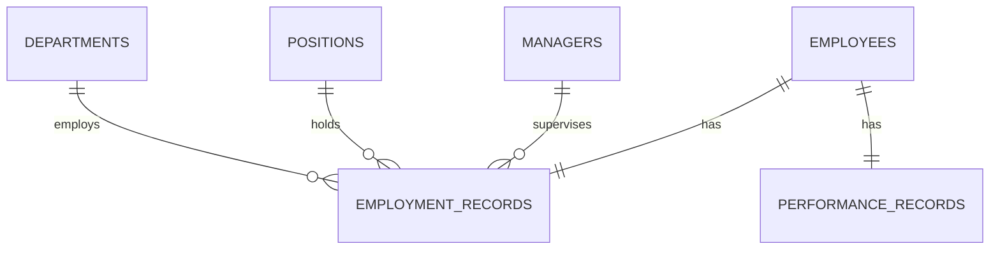
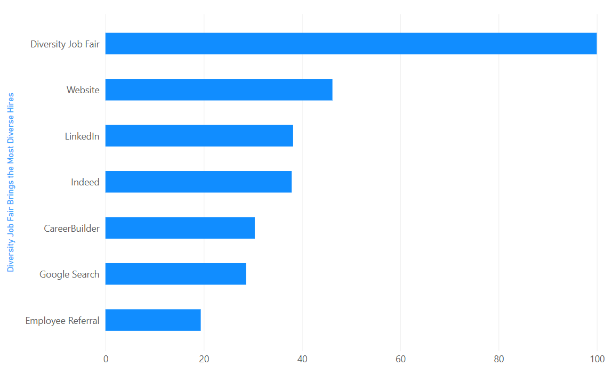
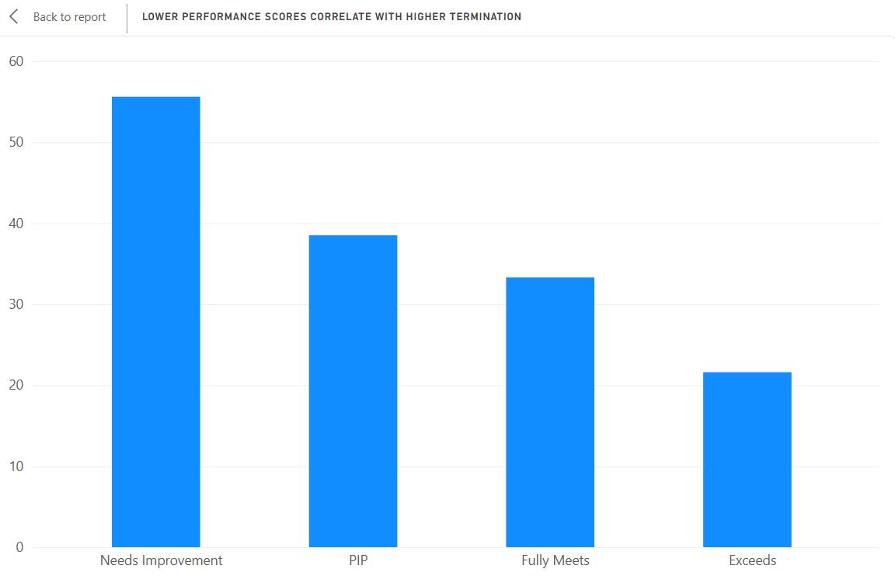
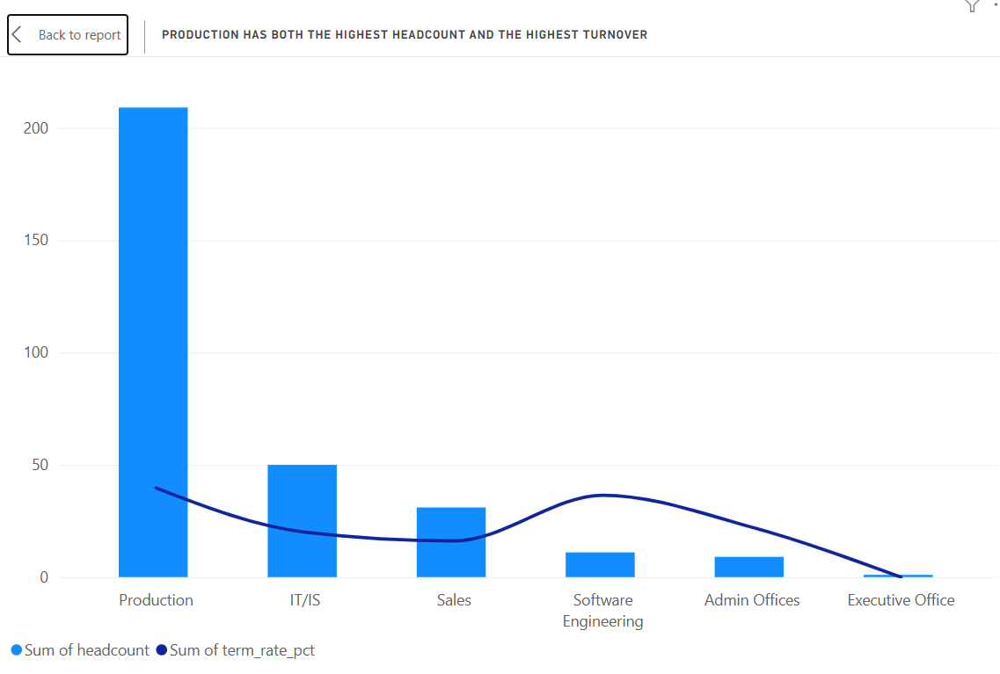
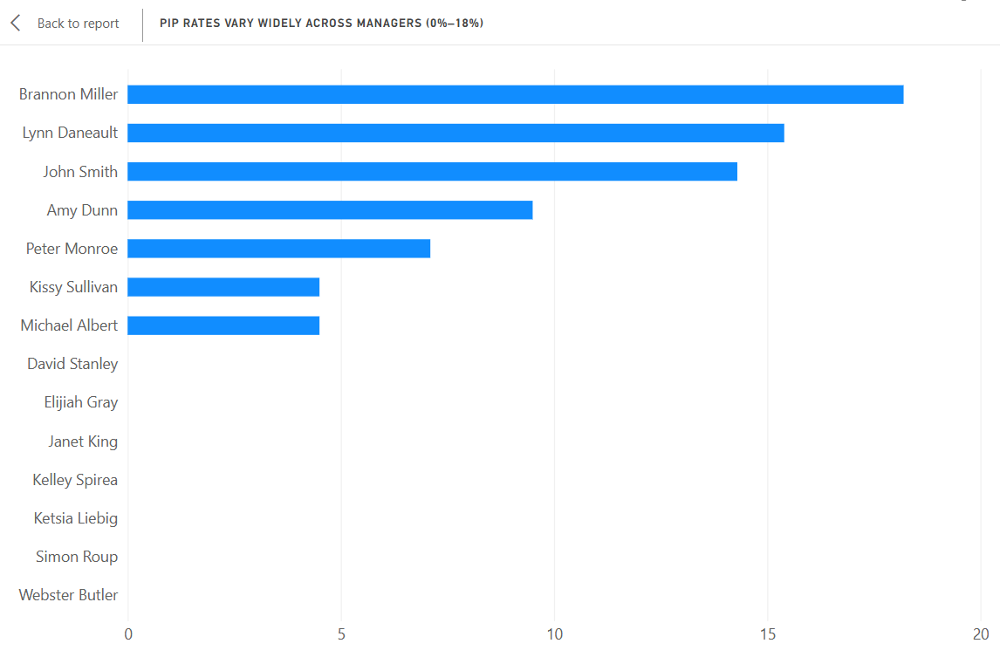
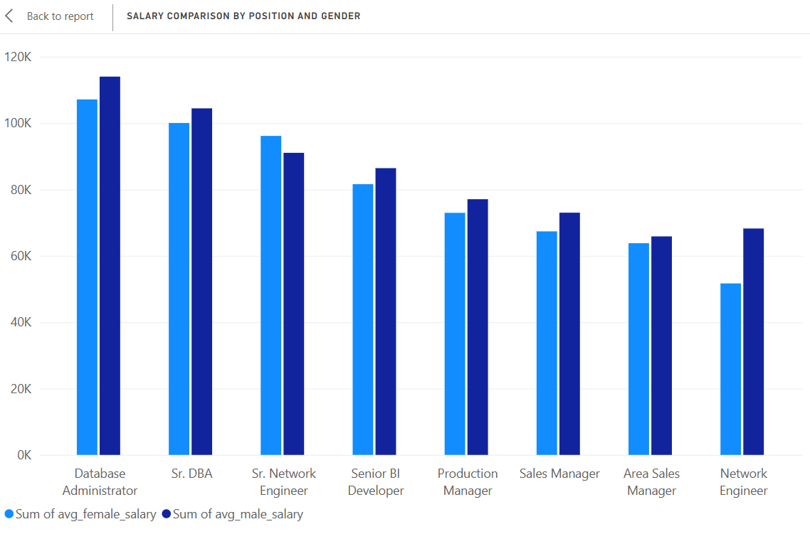

# HR Analytics — SQL Portfolio Project

A relational-database redesign and SQL analysis of the [Human Resources Data Set](https://www.kaggle.com/datasets/rhuebner/human-resources-data-set) (Dr. Carla Patalano & Dr. Rich Huebner), originally distributed as a single flat CSV file.

## Why this project

The source dataset ships intentionally as one wide, imperfect CSV file, designed for tools like Tableau. This project instead:

1. **Normalizes** it into a proper relational schema (6 tables, 3rd normal form)
2. **Finds and documents real data-quality problems** hidden in the raw file — several "ID" columns turn out to be unreliable
3. **Answers, with pure SQL**, the open analytical questions the dataset's original authors posed

Every query was written and debugged by hand in DB Browser for SQLite — no ORM, no pandas, no AI-generated queries copy-pasted without understanding them.

    ## Entity-Relationship Diagram

**Note:** managers do not have their own employee record in this dataset — `manager_id` never matches an `emp_id`, and no manager's name appears as an `employee_name`. Verified empirically before designing the schema, so the `managers` table is intentionally standalone.

## Files

| File | Purpose |
|---|---|
| `01_schema.sql` | DDL — creates all 6 tables with primary/foreign keys |
| `02_import_data.sql` | Cleans and loads data from a raw CSV-import staging table into the normalized schema |
| `03_analysis.sql` | All queries used to answer the 5 business questions |
| `hr_analytics.sqlite` | The final populated database |
| `README.md` | This file |

## How to run it

1. Download `HRDataset_v14.csv` from [Kaggle](https://www.kaggle.com/datasets/rhuebner/human-resources-data-set)
2. Open [DB Browser for SQLite](https://sqlitebrowser.org/), create a new database
3. `File → Import → Table from CSV file...`, name the table `raw_hr_data`
4. Run `01_schema.sql`, then `02_import_data.sql`, then `03_analysis.sql`, in that order, from the **Execute SQL** tab

## Data Quality Issues Found & How They Were Handled

The raw CSV includes several numeric "ID" columns meant to be a 1:1 encoding of a text column — on inspection, three of them are not:

| Raw column | Issue found | Resolution |
|---|---|---|
| `DeptID` | Same ID maps to 2 different department names in 42/311 rows (13.5%) | Dropped. Used the clean `Department` text column instead. |
| `PositionID` | Same ID maps to conflicting position names in 6/311 rows | Dropped. Used the clean `Position` text column instead. |
| `ManagerID` (8 rows) | Blank for 8 employees reporting to "Webster Butler", even though his ID (39) is populated in his other 13 appearances | Filled in with a `CASE` expression, cross-referenced from his other rows |
| `ManagerName` → `manager_id` | Two names ("Brandon R. LeBlanc", "Michael Albert") were each stored under **two different** `ManagerID` values on different rows | Import uses each row's own `ManagerID` directly rather than joining on name, which would silently duplicate rows |
| `Zip` | CSV import auto-detects the column as numeric and strips leading zeros (287/311 rows affected) | Stored as `TEXT`; re-padded to 5 digits with `printf('%05d', ...)` after import |

Columns kept as clean binary flags (`MarriedID`, `Termd`, `FromDiversityJobFairID`) were checked separately — these are intentional simplifications of a richer text column, not errors, and were excluded from the final schema only because the richer text column already captures the same information.

## Key Findings

1. **Diversity Job Fair recruits are 100% non-white** (29/29), while Employee Referral
   recruits are only 19.4% non-white — the lowest of any channel. Referral-based hiring
   appears to reduce organizational diversity here.

   

2. **Termination rate correlates strongly with performance score**: 55.6% for
   "Needs Improvement" vs. 21.6% for "Exceeds".

   

3. **Production has both the highest headcount (209) and the highest termination rate**
   (39.7%).

   

4. Manager-level PIP rates range from 0% to 18.2% across managers with 10+ reports —
   suggesting inconsistent rating standards, genuine team differences, or both; this
   dataset alone can't distinguish which.

   

5. A possible gender pay gap appears in a few positions (e.g. Network Engineer: $68,225
   vs $51,675), but sample sizes are too small (n = 2–5) for statistical confidence —
   flagged for further analysis rather than treated as a conclusion.

   

## Limitations

- Single-snapshot dataset (no employment history), so tenure-over-time analysis isn't possible.
- "Predicting" termination (one of the dataset's suggested questions) requires a statistical/ML model — out of scope for SQL alone. The queries here identify candidate features (department, performance score) a future Python/R model could use.
- Pay-equity findings are descriptive only; no significance testing was performed.

## Tools

SQLite · DB Browser for SQLite

## License

Source data: CC-BY-NC-ND, per the original Kaggle dataset authors (Dr. Carla Patalano & Dr. Rich Huebner). This repository is for educational/portfolio purposes.
